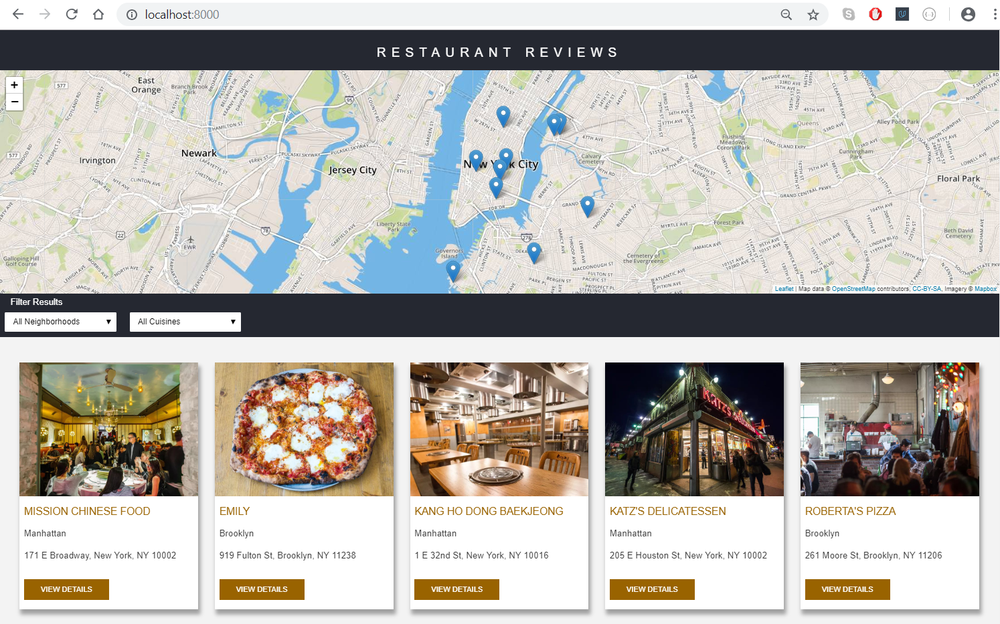

# Restaurant Review App
---
This app is created as part of the Udacity Front-End Developer Nanodegree Program.

## Project Overview:

In this project, a static webpage that lacks accessibility was provided. I incrementally converted the static webpage to a mobile-ready web application. I converted the design to be responsive on different sized displays and accessible for screen reader use. In addition, I added a service worker feature to the app to create a seamless offline experience for the users.

## Project Specification:

The code that was provided the code for the restaurant reviews website had many issues. It was barely usable on a desktop browser, much less a mobile device. Also, It doesn’t include any standard accessibility features, and it doesn’t work offline at all. My job was to update the code to resolve these issues while still maintaining the included functionality.

## Installation

1. Clone this repository to your device.
2. Open the root folder of the repository in a terminal
3. Check if you have python installed by running `python -V` in the terminal
4. Start local server:
 - For Python 2.x: `python -m SimpleHTTPServer 8000`
 - For Python 3.x: `python3 -m http.server 8000`
5. Open [http://localhost:8000](http://localhost:8000)

## Dependencies
* Starter code by [**Udacity**](https://github.com/udacity/mws-restaurant-stage-1).
* [**Leafletjs**](https://leafletjs.com/)
* [**Mapbox**](https://www.mapbox.com/)
* [**Lighthouse**](https://developers.google.com/web/tools/lighthouse/)
* [**Normalize.css**](https://necolas.github.io/normalize.css/)
* [Favicon & App Icon Generator](https://www.favicon-generator.org/)

## License
[MIT](https://github.com/dimikara/Restaurant-Reviews-App-Stage-1/blob/master/LICENSE) License.
